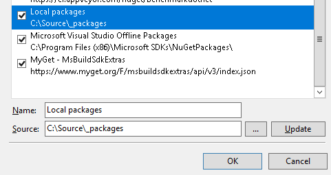

Catel
=====

Name|Badge
---|---
Downloads|
NuGet stable version|
NuGet unstable version|
Open Collective|[](#backers) [](#sponsors)

Catel is an application development platform with the focus on MVVM (WPF).

For documentation, please visit the [documentation portal](https://docs.catelproject.com)

## Features and components

Below are a few features that are available in Catel.

### Catel.Core

Catel.Core is the library you want to include in all your projects, whether you are writing a UI project or not. It contains lots of useful helper methods. The
most important features are listed below:

- Argument validation (e.g. `Argument.IsNotNull(() => myArgument)`)
- Caching
- Data (ModelBase, PropertyBag, Validation)
- Messaging
- Reflection (same reflection API for *every supported platform*)
- Weak references (WeakEventListener)

And more.... 

### Catel.MVVM

Catel.MVVM is the library you want to include when you are writing a WPF UI project and you want to use the MVVM pattern. Catel provides context-aware view and view-model creation, which can be used to solve the [nested user controls problem](https://docs.catelproject.com/vnext/introduction/mvvm/introduction-to-nested-user-controls-problem/). 

The most important features are listed below:

- Auditing
- Collections (FastObservableCollection)
- Commands (Command, TaskCommand, etc)
- Converters (tons of converters out of the box)
- Services
	- MessageService
	- NavigationService
	- OpenFileService
	- BusyIndicatorService
	- SaveFileService
	- UIVisualizerService
- View models
	- Automatic validation
	- Automatic mappings from model to view model
- Views
	- DataWindow
	- UserControl
	- Window

## Example code

### Models

This model has automatic change notifications and validation.

```csharp
public class Person : ValidatableModelBase
{
    public string FirstName { get; set; }

    public string LastName { get; set; }

    protected override void ValidateFields(List<IFieldValidationResult> validationResults)
    {
        if (string.IsNullOrWhitespace(FirstName))
        {
            validationResults.Add(FieldValidationResult.CreateError(nameof(FirstName), "First name is required"));
        }

        if (string.IsNullOrWhitespace(LastName))
        {
            validationResults.Add(FieldValidationResult.CreateError(nameof(LastName), "Last name is required"));
        }
    }    
}
```

### View models

This is a view model with:

- Automatic injection of the DataContext
- Automatic mapping of properties & validation from model => view model

```csharp
public class PersonViewModel : ViewModelBase
{
    public PersonViewModel(Person person)
    {
        Argument.IsNotNull(() => person);

        Person = person;
    }

    [Model]
    private Person Person { get; set; }

    [ViewModelToModel]
    public string FirstName { get; set; }

    [ViewModelToModel]
    public string LastName { get; set; }
}
```

## How to contribute

### Support on Open Collective

Please consider supporting [Catel on Open Collective](https://opencollective.com/catel).

### Translating

To add translations to Catel, the Multilingual App Toolkit (MAT) is required. 

1. Download the [MAT Editor](https://developer.microsoft.com/en-us/windows/develop/multilingual-app-toolkit)
2. Open your specific language (or create it) in the `MultilingualResources` folder, e.g. `./src/Catel.MVVM/MultilingualResources/Catel.MVVM.nl.xlf`
3. Edit the xlf file and create a pull request (PR) with only this file

## Building Catel

**Prerequisites** 

Catel requires Visual Studio 2022 to compile successfully. You also need to ensure you have the following features installed:

Note that the `.vsconfig` in the src root should notify about missing components when opening the solution.

Note that you should run these commands using powershell in the root of the repository.

### Running a build

`.\build.ps1 -target build`

### Running a build with unit tests

`.\build.ps1 -target buildandtest`

### Running a build with local packages

Note that this assumes a local packages directory at `C:\Source\_packages`, which can be added to the NuGet feeds:



`.\build.ps1 -target buildandpackagelocal`

## WPF components based on Catel

If you are planning on using WPF, there is a huge set (60+) of free open-source components 
available based on Catel. All these open source are developed by a company called WildGums 
(see https://www.wildgums.com) and provided to the community for free. The components are well 
maintained and being used in several commercial WPF applications.

For more information, see https://github.com/wildgums

## Contributors

This project exists thanks to all the people who contribute. [[Contribute](CONTRIBUTING.md)].
<a href="graphs/contributors"></a>

## Backers

Thank you to all our backers! 🙏 [[Become a backer](https://opencollective.com/Catel#backer)]

<a href="https://opencollective.com/Catel#backers" target="_blank"></a>

## Sponsors

Support this project by becoming a sponsor. Your logo will show up here with a link to your website. [[Become a sponsor](https://opencollective.com/Catel#sponsor)]

<a href="https://opencollective.com/Catel/sponsor/0/website" target="_blank"></a>
<a href="https://opencollective.com/Catel/sponsor/1/website" target="_blank"></a>
<a href="https://opencollective.com/Catel/sponsor/2/website" target="_blank"></a>
<a href="https://opencollective.com/Catel/sponsor/3/website" target="_blank"></a>
<a href="https://opencollective.com/Catel/sponsor/4/website" target="_blank"></a>
<a href="https://opencollective.com/Catel/sponsor/5/website" target="_blank"></a>
<a href="https://opencollective.com/Catel/sponsor/6/website" target="_blank"></a>
<a href="https://opencollective.com/Catel/sponsor/7/website" target="_blank"></a>
<a href="https://opencollective.com/Catel/sponsor/8/website" target="_blank"></a>
<a href="https://opencollective.com/Catel/sponsor/9/website" target="_blank"></a>
