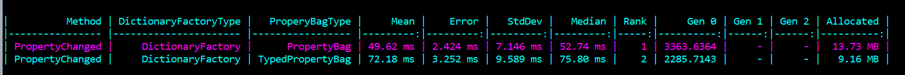

A property bag is a class that can hold multiple (dynamically registered) values. It can be compared to a dictionary, but does a bit more since it will also do integrity checks and change notifications.

Catel ships with multiple property bag implementations out of the box and uses a shared interface `IPropertyBag` to make it easy to switch between multiple implementations.

```
var propertyBag = new PropertyBag();

propertyBag.SetValue("MyBoolValue", true);
propertyBag.SetValue("MyIntValue", 42);
propertyBag.SetValue("MyStringValue", "my string");
```

## PropertyBag

The `PropertyBag` class has been in Catel for a long time and uses a single `Dictionary<string, object>` as backing storage.

The upside of using a single dictionary as backing store is that there is no need for multiple allocations of each backing type dictionary. The downside is that any value type stored in the `PropertyBag` must be boxed to an object.

Since Catel 5.12, the `PropertyBag` uses the `BoxingCache` to try and re-use existing boxed values to try and minimize the memory pressure while boxing.

The best use case for the `PropertyBag` is reference objects.

## TypedPropertyBag

The `TypedPropertyBag` uses separate dictionaries for each value type. To prevent excessive memory by default, each value type dictionary will only be instantiated when actually used for the first time.

The advantage of storing values inside typed dictionaries is that it removes the requirement for boxing, therefore resulting in improved memory usage as shown below in the benchmarks comparing the different implementations:



The downside of the `TypedPropertyBag` is that it is *slightly* slower than the `PropertyBag`.

The `TypedPropertyBag` will start showing (memory usage) benefits over the `PropertyBag` implementation when multiple value types are being stored in the property bag.

