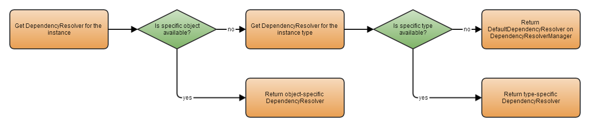

# Introduction to 

Managing different scoping of service locators and dependency injection can be hard. To aid developers with this, the `IDependencyResolver` and `DependencyResolverManager` are introduced.

## Why the need for a DependencyResolver

That's a good question. Catel already provides the `IServiceLocator` which allows to resolve types. The downside is that if you want to customize the way dependencies are resolved in Catel, you will have to implement a custom version of the `ServiceLocator`. To make it simple to customize this behavior,` `the `DependencyResolver` is introduced.

The main strategy will be to use the `DependencyResolver` instead of `ServiceLocator` to resolve the types in Catel, starting with version 3.8

Though in simple situations, Catel will resolve and inject all types automatically, there are a few exceptions to the rule. One of these exceptions are extension methods. These are static classes which can be used to add functionality to an object. The downside is that you cannot use dependency injection in static classes, and each object that is extended can have their own scoping of dependency resolvers. To solve this issue, Catel introduces the `DependencyResolverManager`. This is a manager that keeps track of all types and objects and the `DependencyResolver` that were used to create the object. This way it is still possible to retrieve additional dependencies in extensions methods in the ``same`` dependency resolver the type was created with.

To illustrate this issue, take a look at the view model below:

```
// Set up a different scoping with a custom service locator
var serviceLocator = new ServiceLocator();
// ... register custom services here
var typeFactory = serviceLocator.ResolveType<ITypeFactory>();

var vm = typeFactory.CreateInstance<MyViewModel>();
```

In this example, a view model is created with a custom dependency scope. When writing an extension method for the view models, it is impossible to get to this custom scope:

```
public static class MyViewModelExtensions
{
    public static void DoSomething(this MyViewModel myViewModel)
    {
         // You can use ServiceLocator.Default here, but that is a `different and wrong` scope
         var additionalDependency = ServiceLocator.Default.ResolveType<IAdditionalDependency>();
    }
}
```

One option to solve this is to create a property on the view model called `DependencyResolver` or `ServiceLocator`. However, it is ``not`` the responsibility of the view model to store this property. In fact, the view model does not know which scoping was used to create itself. The only way to solve this is to inject the `IServiceLocator` into the view model, but that's not a good practice.

Below is a rewritten version of the extensions class which uses the `DependencyResolverManager`:

```
public static class MyViewModelExtensions
{
    public static void DoSomething(this MyViewModel myViewModel)
    {
         // Get the `right` scope
         var dependencyResolverManager = DependencyResolverManager.Default;
         var dependencyResolver = dependencyResolverManager.GetDependencyResolverForInstance(myViewModel);
         var additionalDependency = dependencyResolver.Resolve<IAdditionalDependency>();
    }
}
```

Now you have the actual `IDependencyResolver` that was use to create the view model and can easily provide the right logic with the right scoping.

Note that there will only be a single instance of a `DependencyResolverManager`. It is possible to customize the default instance, but there is no need for different scoping of `DependencyResolverManager` instances so it is valid to use the static instance

## Managing the dependency resolvers per instance

The `DependencyResolverManager` can manage dependency resolvers per instance. This way it is possible to retrieve the actual dependency resolver for a specific object instance.

### Registering a dependency resolver for an instance

To register a dependency resolver for an instance, use this code:

```
var serviceLocator = new ServiceLocator();
var dependencyResolver = new CatelDependencyResolver(serviceLocator);
var myObject = new MySpecialObject();

var dependencyResolverManager = DependencyResolverManager.Default;
dependencyResolverManager.RegisterDependencyResolverForInstance(myObject, dependencyResolver);
```

Note that it is not required to register a `DependencyResolver` for instances created with the `TypeFactory`. The `TypeFactory` automatically registers the `DependencyResolver` used in the `DependencyResolverManager`.

### Retrieving a dependency resolver for an instance

To retrieve the dependency resolver for a specific instance, use this code:

```
var dependencyResolverManager = DependencyResolverManager.Default;
var dependencyResolver = dependencyResolverManager.GetDependencyResolverForInstance(myObject);
```

Below is a graph that shows how the dependency resolver of an instance is determined:



## Managing the dependency resolvers per type

The `DependencyResolverManager` can manage dependency resolvers per type. This way it is possible to retrieve the actual dependency resolver for a specific type.

### Registering a dependency resolver for a type

To register a dependency resolver for a type, use this code:

```
var serviceLocator = new ServiceLocator();
var dependencyResolver = new CatelDependencyResolver(serviceLocator);

var dependencyResolverManager = DependencyResolverManager.Default;
dependencyResolverManager.RegisterDependencyResolverForType(typeof(MyClass), dependencyResolver);
```

Note that these registrations are type-specific. You cannot register an interface and all classes deriving from that interface will return the same `DependencyResolver`. All actual types must be registered separately.

### Retrieving a dependency resolver for a type

To retrieve the dependency resolver for a specific instance, use this code:

```
var dependencyResolverManager = DependencyResolverManager.Default;
var dependencyResolver = dependencyResolverManager.GetDependencyResolverForType(typeof(MyClass));
```

## Customizing the default DependencyResolver

By default, the `DependencyResolverManager` creates a `CatelDependencyResolver` that wraps the `ServiceLocator.Default` instance. In simple applications this is sufficient to get everything working. However sometimes it might be needed to customize the` `default `DependencyResolver`. To change the default one, use the code below:

```
var dependencyResolverManager = DependencyResolverManager.Default;
dependencyResolverManager.DefaultDependencyResolver = new MyCustomDependencyResolver();
```

## Customizing the DependencyResolverManager

Customizing the `DependencyResolverManager` is not recommended. If you still want to do this for whatever reason, create a class implementing the `IDependencyResolverManager` or derive from the `DependencyResolverManager`:

```
public class CustomizedDependencyResolverManager : DependencyResolverManager
{
    public override IDependencyResolver GetDependencyResolverForType(Type type)
    {
        if (type == typeof(MySpecialClass))
        {
            return new MySpecialDependencyResolver();
        }

        return base.GetDependencyResolverForType(type);
    }
}
```

Note that there is no use to override the `DependencyResolverManager` as the example, but this keeps it easy to understand

Then set the `DependencyResolverManager.Default `static property:

```
DependencyResolverManager.Default = new CustomizedDependencyResolverManager();
```

