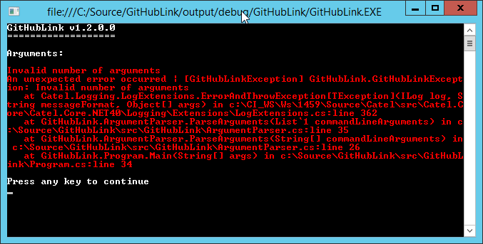

The `ConsoleLogListener` writes messages to the console with automatic colors:



To add it, use the code below:

```
var logListener = new ConsoleLogListener();
logListener.IgnoreCatelLogging = true;
// TODO: Customize options

LogManager.AddListener(logListener);
```

