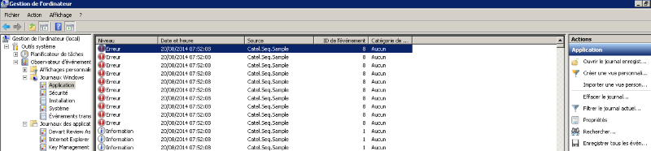

The `EventLogListener` allow to write log data to the system event log. 

 

To add it, use the code below:

```
var logListener = new EventLogListener();
logListener.IgnoreCatelLogging = true;
// TODO: Customize options

LogManager.AddListener(logListener);
```

This log listener is currently available only for the full .net framework


