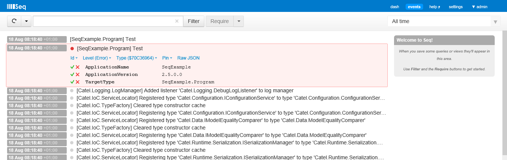

[Seq](http://getseq.net/) is a structured logs server for .NET Apps. It act like a logs repository, allow to diagnostic by query your logs using a natural syntax, react on notifying you through email or instant messages and so on ...



To use the Seq log listener, use the following code:

```
var logListener = new SeqLogListener();
logListener.IgnoreCatelLogging = true;
// TODO: Customize options

LogManager.AddListener(logListener);
```

This one can also be used on configuration file:

```
<catel>
    <logging>
      <listeners>
        <listener type="Catel.Logging.SeqLogListener" ServerUrl="http://localhost:5341" IgnoreCatelLogging="true" IsDebugEnabled="false" IsInfoEnabled="true" IsWarningEnabled="true" IsErrorEnabled="true" />
      </listeners>
    </logging>
</catel>
```

This log listener is currently available only for the full .net framework


