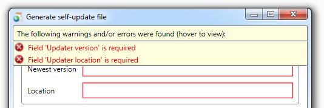

There are some very important controls in Catel which help with visualizing the validation results.

## InfoBarMessageControl

Ever wanted to show the details of error messages to your end-users? Then, the `InfoBarMessageControl` is the control to use! The control shows a summary of all business and field errors provided by bindings on objects that implement the `IDataErrorInfo` interface.



In combination with the `WarningAndErrorValidator` control, the `InfoBarMessageControl` can even show field and business warnings for objects that implement the `IDataWarningInfo` interface that ships with Catel.

```
<catel:InfoBarMessageControl>
    <!-- Actual content here -->
</catel:InfoBarMessageControl>
```

The `InfoBarMessageControl` subscribes to the `Validation` class. This class is responsible for showing the red border around the controls that WPF shows by default. Then, it requests the actual field error property of the data item. This is added to an internal collection of error messages, and therefore the control is able to show the errors of all bindings.

When the `WarningAndErrorValidator` control is found as a child control, the `InfoBarMessageControl` also subscribes to the events exposed by the `WarningAndErrorValidator`. The internal working of that control is explained later in this article. When a data object is subscribed via the `WarningAndErrorValidator`, the `InfoBarMessageControl` will also handle the warnings and business errors of that data object.

## WarningAndErrorValidator

The `WarningAndErrorValidator` control is not visible to the end user. The only thing this control takes care of is to forward business errors and warnings to controls that are interested in them. The only control that ships with Catel is the `InfoBarMessageControl`. Thanks to the `WarningAndErrorValidator`, the `InfoBarMessageControl` is able to show business errors and warnings to the end user.

```
<catel:WarningAndErrorValidator Source="{Binding MyObject}" />
```

The `WarningAndErrorValidator` needs to be placed inside an `InfoBarMessageControl`. The control then subscribes to all property changed events to make sure it receives all change notifications. Then, on every property change, the control checks whether the sender either implements the `IDataErrorInfo` or `IDataWarningInfo` interfaces.

When an error or warning is found on the changed property, the control invokes the corresponding events so the `InfoBarMessageControl` can show the right information. When an error or warning no longer exists in a model, a *Removed* event is invoked so the `InfoBarMessageControl` knows that the error or warning should be removed from the summary.

## Styling in DataWindow

A `InfoBarMessageControl` is automatically added to the `DataWindow`, if you want to use a different style for this `InfoBarMessageControl`, you must override the default style, add your own `InfoBarMessageControl` and disable the default `InfoBarMessageControl` from the `DataWindow`.

1.  Create a custom style based on the [default style](https://github.com/Catel/Catel/blob/master/src/Catel.MVVM/Themes/InfoBarMessageControl.generic.xaml).
2.  Change the x:Key from  x:Key="{x:Type local:InfoBarMessageControl}" to  x:Key="yourCustomStyleKey"
3.  Set the InfoBarMessageControlGenerationMode to None

    ```
            /// <summary>
            /// Initializes a new instance of the <see cref="DataWindow"/> class.
            /// </summary>
            /// <param name="viewModel">The view model to inject.</param>
            /// <remarks>
            /// This constructor can be used to use view-model injection.
            /// </remarks>
            public DataWindow(DataWindowViewModel viewModel)
                : base(viewModel, DataWindowMode.Custom, null, DataWindowDefaultButton.None, true, InfoBarMessageControlGenerationMode.None)
            {
                InitializeComponent();
            }
    ```

4.  Add a new `InfoBarMessageControl` as root control to your `DataWindow` and set the style.

    ```
    <catel:InfoBarMessageControl  Style="{DynamicResource yourCustomStyleKey}">
            <Grid>
                <catel:WarningAndErrorValidator Source="{Binding}" />
                //Your content 
            </Grid>
    </catel:InfoBarMessageControl>
    ```

