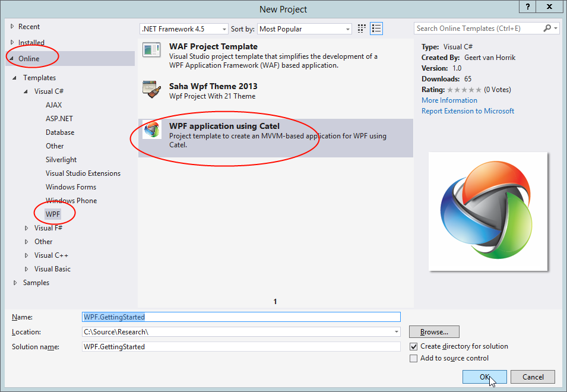
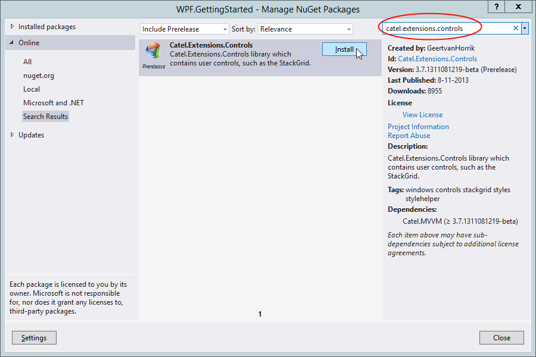
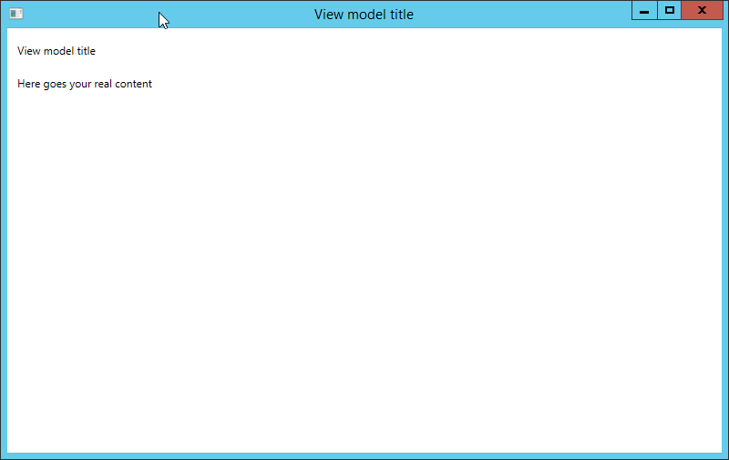
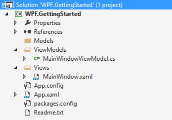

---
title: "Creating the WPF project" 
description: ""
weight: 10
---
In this step we will create the project and add the relevant NuGet packages.

{}
This guide uses the on-line templates that are available in the Visual Studio gallery. If you can't find the templates on-line, please download them [here](http://www.catelproject.com/download/general-files/).
{}

## Creating the project

To create the project, start Visual Studio and choose *File =\> New Project*... Then switch to the *on-line template section* as you can see in the screenshot below and search for Catel:

Pick a good name, in our case *WPF.GettingStarted* and click OK. The template will now be downloaded and the project will be created.

## Adding the NuGet packages

As soon as the project is created, the *Readme.txt* will be opened and instruct your what to do. Right-click on the solution =\> *Manage NuGet packages... *Then search for `Catel.MVVM` and click *Install*.

## Running the project

Now the NuGet packages are installed, the project is created and can be built. The basics are created and the application is ready:

## Explanation of the project structure

The project template creates the project structure that fits best with Catel. Below is an explanation of the new project structure:

The `ViewModels` folder contains the `MainWindowViewModel`, which contains the logic for the interaction with the `MainWindow` view.

The `Views` folder contains the `MainWindow`, which represents the actual view.

This structure ties to how Catel implements viewmodel location. You do not however have to follow this structure and could for example decide to place both the View and ViewModel under the same namespace/folder and implement a custom `IViewModelLocator`.

## Up next

[Creating the models]()

