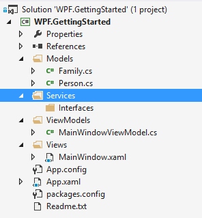

In this step we will create services that will serialize the models from/to disk. Services are a great way to abstract functionality that can be used in every part of the application. This guide will also register the service in the *ServiceLocator* so it can be injected in view models.

## Creating the service definition

The first thing to do is to create the *Services* folder to group the services. Below is a screenshot of how to solution will look after creating the folders:



Then add a new interface to the `Interfaces` folder named `IFamilyService`. This will manage the families that are avaiable. Below is the interface defined:

```
namespace WPF.GettingStarted.Services
{
    using WPF.GettingStarted.Models;

    public interface IFamilyService
    {
        IEnumerable<Family> LoadFamilies();
        void SaveFamilies(IEnumerable<Family> families);
    }
}
```

## Creating the service implementation

Below is the implementation of the service which will actually take care of saving and loading of the families:

```
namespace WPF.GettingStarted.Services
{
    using System.Collections.Generic;
    using System.IO;
    using Catel.Collections;
    using Catel.Data;
    using WPF.GettingStarted.Models;

    public class FamilyService : IFamilyService
    {
        private readonly string _path;
        private readonly IXmlSerializer _xmlSerializer;

        public FamilyService(IXmlSerializer xmlSerializer)
        {
            Argument.IsNotNull(() => xmlSerializer);

            _xmlSerializer = xmlSerializer;

            string directory = Catel.IO.Path.GetApplicationDataDirectory("CatenaLogic", "WPF.GettingStarted");

            _path = Path.Combine(directory, "family.xml");
        }

        public IEnumerable<Family> LoadFamilies()
        {
            if (!File.Exists(_path))
            {
                return new Family[] { };
            }

            using (var fileStream = File.Open(_path, FileMode.Open))
            {
                var settings = _xmlSerializer.Deserialize<Settings>(fileStream);
                return settings.Families;
            }
        }

        public void SaveFamilies(IEnumerable<Family> families)
        {
            var settings = new Settings();
            settings.Families.ReplaceRange(families);

            using (var fileStream = File.Open(_path, FileMode.Create))
            {
                _xmlSerializer.Serialize(settings, fileStream);
            }
        }
    }
}
```

## Registering the service in the ServiceLocator

Now we have created the service, it is time to register it in the `ServiceLocator`. In the `App.xaml.cs`, add the following code:

```
var serviceLocator = ServiceLocator.Default;
serviceLocator.RegisterType<IFamilyService, FamilyService>();
```

## Adding the service usage to the MainWindowViewModel

Now the service is registered, it can be used anywhere in the application. A great place to load and save the families is in the `MainWindowViewModel` which contains all the logic of the main application window. 

### Injecting the service via dependency injection

To get an instance of the service in the view model, change the constructor to the following definition.

```
private readonly IFamilyService _familyService;

/// <summary>
/// Initializes a new instance of the <see cref="MainWindowViewModel"/> class.
/// </summary>
public MainWindowViewModel(IFamilyService familyService)
{
    Argument.IsNotNull(() => familyService);

    _familyService = familyService;
}
```

As you can see in the code above, a new field is created to store the dependency `IFamilyService`. Then the constructor ensures that the argument is not null and stores it in the field.

### Creating the Families property on the MainWindowViewModel

The next thing we need is a `Families` property on the `MainWindowViewModel` to store the families in we load from disk. Below is the property definition for that:

```
/// <summary>
/// Gets the families.
/// </summary>
public ObservableCollection<Family> Families
{
    get { return GetValue<ObservableCollection<Family>>(FamiliesProperty); }
    private set { SetValue(FamiliesProperty, value); }
}

/// <summary>
/// Register the Families property so it is known in the class.
/// </summary>
public static readonly PropertyData FamiliesProperty = RegisterProperty("Families", typeof(ObservableCollection<Family>), null);
```

### Loading the families at startup

Now we have the `IFamilyService` and the `Families` property, it is time to combine these two. To do this, we need to override the `InitializeAsync` method on the view model which is automatically called as soon as the view is loaded by Catel:

```
protected override async Task InitializeAsync()
{
    var families = _familyService.LoadFamilies();
    Families = new ObservableCollection<Family>(families);
}
```

### Saving the families at shutdown

To save the families at shutdown, override the `CloseAsync` method on the view model which is automatically called as soon as the view is closed by Catel:

```
protected override async Task CloseAsync()
{
    _familyService.SaveFamilies(Families);
}
```

After running the application once, a new file will be stored in the following directory:

*C:\\Users\\[yourusername]\\AppData\\Roaming\\CatenaLogic\\WPF.GettingStarted*

## Up next

[Creating the view models]()

