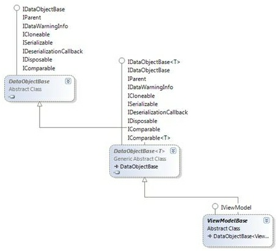

The View Models in Catel are very easy to write, and give the end-user a great flexibility in how to approach the Models. This part of the article will explain the classes that make it possible to easily create View Models.

The `ViewModelBase` class is the most important class of all in the MVVM Framework of Catel. Of course, it can't do anything useful without the other classes, but all the View Models that are created using Catel derive of this class. `ViewModelBase` is based on the `ModelBase` class that ships with Catel. Thanks to the existence of that class, the MVVM framework was set up very quickly (although “very quickly” is relative). Below is a class diagram that shows the class tree:



The class diagram above shows how many default interfaces of the .NET Framework are supported in the `ModelBase` class. Since most of these interfaces are used by WPF as well, the *ViewModelBase* class itself can take huge advantage of the implementation of `ModelBase`.

Because `ViewModelBase` derives from `ModelBase`, you can declare properties exactly the same way. Even better, you can simply use `ModelBase` (or the extended `SavableModelBase`) to create (and save) your Models, and use `ViewModelBase` as the base for all the View Models.

## Creating a view model

To declare a View Model, use the following code snippet:

-   vm - defines a new view model

When using the *vm* code snippet, this is the result:

```
/// <summary>
/// $name$ view model.
/// </summary>
public class $name$ViewModel : ViewModelBase
{
   #region Fields
   #endregion

   #region Constructors
   /// <summary>
   /// Initializes a new instance of the <see cref="$name$ViewModel"/> class.
   /// </summary>
   public $name$ViewModel ()
   {
   }
   #endregion

   #region Properties
   /// <summary>
   /// Gets the title of the view model.
   /// </summary>
   /// <value>The title.</value>
   public override string Title { get { return "View model title"; } }

   // TODO: Register models with the vmpropmodel codesnippet
   // TODO: Register view model properties with the vmprop or vmpropviewmodeltomodel codesnippets
   #endregion

   #region Commands
   // TODO: Register commands with the vmcommand or vmcommandwithcanexecute codesnippets
   #endregion

   #region Methods
   #endregion
}
```

## Declaring properties

Note that declaring properties works exactly the same as declaring properties for the *ModelBase*

There are several code snippets available to create View Model properties:

-   vmprop - Defines a simple View Model property.
-   vmpropmodel - Defines a View Model property with *ModelAttribute*. The property is also made private by default.
-   vmpropviewmodeltomodel - Defines a View Model property with *ViewModelToModelAttribute*.

When using the *vmprop* code snippet, this is the result:

```
/// <summary>
/// Gets or sets the name.
/// </summary>
public string Name
{
    get { return GetValue<string>(NameProperty); }
    set { SetValue(NameProperty, value); }
}

/// <summary>
/// Register the Name property so it is known in the class.
/// </summary>
public static readonly PropertyData NameProperty = RegisterProperty("Name", typeof(string));
```

In the View, it is now possible to bind to the *Name* property of the View Model, as long as *DataContext* is set to an instance of the View Model.

## Declaring commands

There are several code snippets available to create View Model commands:

-   vmcommand - Defines a command that is always executable.
-   vmcommandwithcanexecute - Defines a command that implements a *CanExecute* method to determine whether the command can be invoked on the View Model in its current state.

When using the *vmcommandwithcanexecute* code snippet, this is the result:

```
/// <summary>
/// Gets the Add command.
/// </summary>
public Command<object, object> Add { get; private set; }

// TODO: Move code below to constructor
Add = new Command<object, object>(OnAddExecute, OnAddCanExecute);
// TODO: Move code above to constructor

/// <summary>
/// Method to check whether the Add command can be executed.
/// </summary>
/// <param name="parameter">The parameter of the command.</param>
private bool OnAddCanExecute(object parameter)
{
    return true;
}

/// <summary>
/// Method to invoke when the Add command is executed.
/// </summary>
/// <param name="parameter">The parameter of the command.</param>
private void OnAddExecute(object parameter)
{
    // TODO: Handle command logic here
}
```

The only thing left to do now is to move the creation of the command to the constructor (as the comments already instructs you to).

In the View, it is now possible to bind any *Command* property (such as the *Command* property of a *Button*) to the *Add* property of the View Model, as long as DataContext is set to an instance of the View Model.

## Adding validation

Because the *ViewModelBase* class derives from *ModelBase*, it provides the same power of validation that the *ModelBase* class has to offer. *ModelBase* (and thus *ViewModelBase*) offers the following types of validation:

-   Field warnings
-   Business warnings
-   Field errors
-   Business errors

*ViewModelBase* uses smart validation. This means that if the object is already validated, the object is not validated again to make sure that the View Models don't hit too much on the performance. Only when a property on the View Model changes, validation will be invoked. Of course, if required, it is still possible to force validation when the View Model must be validated, even when no properties have changed.

To implement field or business rule validation, you only have to override *ValidateFields* and/or the *ValidateBusinessRules* method:

```
/// <summary>
/// Validates the field values of this object. Override this method to enable
/// validation of field values.
/// </summary>
/// <param name="validationResults">The validation results, add additional results to this list.</param>
protected override void ValidateFields(List<FieldValidationResult> validationResults)
{
    if (!string.IsNullOrEmpty(FirstName))
    {
        validationResults.Add(FieldValidationResult.CreateError(FirstNameProperty, "First name cannot be empty"));
    }
}

/// <summary>
/// Validates the field values of this object. Override this method to enable
/// validation of field values.
/// </summary>
/// <param name="validationResults">The validation results, add additional results to this list.</param>
protected override void ValidateBusinessRules(List<BusinessRuleValidationResult> validationResults)
{
    if (SomeBusinessErrorOccurs)
    {
        validationResults.Add(BusinessRuleValidationResult.CreateError("A business error occurred"));
    }
}
```

Note that it is also possible to re-use validation in a model using *ModelToViewModel* mappings or even external validation such as *FluentValidation*

There are also other ways to add validation to a data object:

-   Validation via data annotations - attributes such as the *RequiredAttribute*
-   Validation via *IValidator* - custom validation such as *FluentValidation*

The great thing is that Catel will gather all validation results from all different mappings and combine these into the *ValidationContext*. This context can be used to query all sorts of validation info about an object.

## Interaction with models

One of the most important reasons why a View Model is created is because it serves as the glue between a View and the Model. The communication between the View and the View Model is fully taken care of by WPF in the form of Bindings. The problem is that most of the time, a View Model is used to show a subset of a Model (which is, for example, a database entity).

Most MVVM frameworks (actually, I haven't seen anyone not requiring manual updating) require manual updating, which brings us back to the stone age (remember the WinForms time setting the controls at startup, and reading the values at the end?). Catel solves this issue by providing convenience attributes that take care of this dumb getting/setting story between the View Model and the Model. Catel fully supports getting/setting the values from/to the Model, but believe me: you will love the attributes that are described next.

### ModelAttribute

To be able to map values from/to a Model, it is important to know the actual Model. So, to let the View Model know what property represents the Model, *ModelAttribute* can be used like shown below:

```
/// <summary>
/// Gets or sets the person.
/// </summary>
[Model]
public Person Person
{
    get { return GetValue<Person>(PersonProperty); }
    private set { SetValue(PersonProperty, value); }
}

/// <summary>
/// Register the Person property so it is known in the class.
/// </summary>
public static readonly PropertyData PersonProperty = RegisterProperty("Person", typeof(Person));
```

A Model setter is normally written as private (you normally don't want a UI to be able to change a Model), but the getter is public because you might want to read info from it.

Note that you should use the *vmpropmodel* code snippet to create Model properties

Models in Catel are handled as very, very special objects. This means that as soon as a Model is set, Catel tries to call the *IEditableObject.BeginEdit* method. Then, as soon as the Model is changed without being saved, or if the View Model is canceled, the Model is correctly canceled via *IEditableObject.CancelEdit*. If the Model is saved, the active Models will be committed via *IEditableObject.EndEdit*. I will leave the rest of the magic out of this article, but if you have any questions about it, don't hesitate to contact us!

### ViewModelToModelAttribute

Now that we know how to declare a property as a Model, it is time to learn how we can communicate with it. Normally, you would have to watch the Model to make sure it is synchronized correctly when the Model is updated. With Catel, this is not necessary any longer. Simply use *ViewModelToModelAttribute*, and you will get the following advantages:

-   Models are automatically being watched for changes, thus if a mapped property changes, the View Model is updated accordingly;
-   When a View Model is changed, this property is automatically mapped to the Model;
-   When the Model changes, the View Model is initialized automatically with the values of the new Model;
-   When a Model has an error or warning (business or field), the warnings are mapped to the View Model so you can “re-use” the validation of the Model inside your View Model.

So, you get all of this for free? No, you will have to decorate your property with *ViewModelToModelAttribute*, like shown below:

```
/// <summary>
/// Gets or sets the first name.
/// </summary>
[ViewModelToModel("Person")]
public string FirstName
{
    get { return GetValue<string>(FirstNameProperty); }
    set { SetValue(FirstNameProperty, value); }
}

/// <summary>
/// Register the FirstName property so it is known in the class.
/// </summary>
public static readonly PropertyData FirstNameProperty = RegisterProperty("FirstName", typeof(string));
```

The code example is the easiest usage of the attribute that is available. It only provides the name of the Model property. This is required because it is possible (but not likely) to have multiple Models. But what if the property on your Model has a different name than your View Model? No problem, use the overload of the attribute as shown below:

```
[ViewModelToModel("Person", "RealFirstName")]
public string FirstName
///... (remaining code left out for the sake of simplicity)
```

The code above will map the *FirstName* property of the View Model to the *RealFirstName* property of the Person model.

### ExposeAttribute

The *ViewModelToModelAttribute* is a great way to map properties between the model and the view model. However, sometimes the mappings are not required for manual coding and should only be exposed from inside the view model to the view. The *ExposeAttribute* is great way to simplify this process. The code below is the same as declaring a model property named Person and 3 additional properties using the *ViewModelToModelAttribute*:

```
/// <summary>
/// Gets or sets the person.
/// </summary>
[Model]
[Expose("FirstName")]
[Expose("MiddleName")]
[Expose("LastName")]
private Person Person
{
    get { return GetValue<Person>(PersonProperty); }
    set { SetValue(PersonProperty, value); }
}

/// <summary>
/// Register the Person property so it is known in the class.
/// </summary>
public static readonly PropertyData PersonProperty = RegisterProperty("Person", typeof(Person));
```

## Interaction with other view models

Now that we've seen how easy it is to communicate between the View Model and the Model, you want more, right? I know how it is: “You let 'em have one finger, they take your whole hand”. No worries, you can have my right hand, as long as I can keep my left one. Anyway, the developers of Catel are prepared for this. So, let's talk about the interaction with other View Models.

Say, you have a multiple document interface (MDI as it was called in the old days). If you are following MVVM principles, every document (or tab) has its own View Model. Then, you want to be aware of updates of a single type of View Model. Say, for example, that there is a View Model representing a family called *FamilyViewModel*. This View Model is probably interested in changes in the *PersonViewModel*.

### ViewModelManager

Let's start with the basics. As we have learned earlier in this article, all View Models created with the help of Catel derive from the *ViewModelBase* class. One of the things that this class does is that it registers itself with the *ViewModelManager* class when it is being created, and it unregisters itself again when it is closed. So, simply said, *ViewModelManager* is a class that holds a reference to all existing View Models at the moment.

### MessageMediator

Catel also offers a solution to the message mediator pattern in the form of the *MessageMediator* class. This is all described in the next section "Message mediator".

