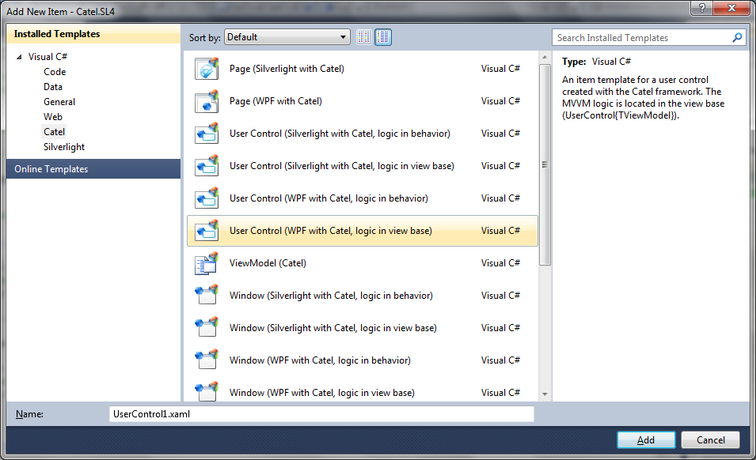
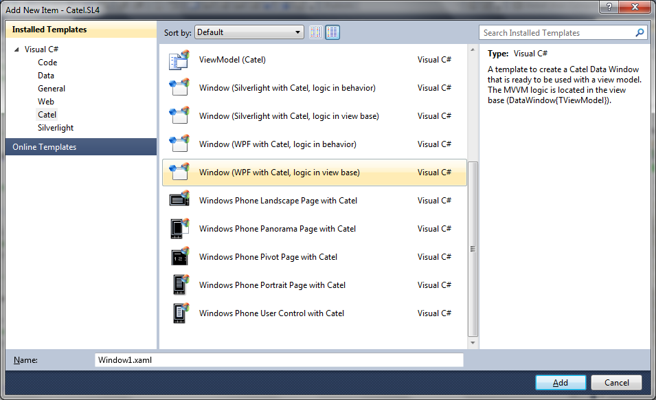

There are lots of item templates available for Catel so it is really easy to develop new views very fast.

## Difference between logic in view base or behavior

As you might have noticed, there are lots of "double" item templates. However, there is a substantial difference between the item templates that implement the logic in the view base or the logic in a behavior.

Shortly said, a view with the logic in the view base is defined like this:

```
public class MyView : Catel.Windows.Controls.UserControl
{
    // rest of the class definition
}
```

This means that the logic for MVVM is located in the view base (in this example, the UserControl).

An item template where the logic is located in a behavior uses regular controls and uses one of the available MVVM behaviors to implement the logic. The behaviors are extremely powerful, but we still recommend the use of logic in the view base since that takes more work out of the hands from the developer.

## View model

The view model is the easiest and smallest item template available. The question is even whether a new view model should be created via an item template or by using the vm code snippet.

## User control

The user control templates create a user control deriving from UserControl. First it is very important to make a decision whether the logic should be implemented in the view base or a behavior. Then, select the appropriate template:



The item template will assume that a view model with the same name is already created. For example, if a view with the name *PersonView* is created, the template assumes that the view model name is *PersonViewModel*. If you prefer a different naming convention, simply change the view model type name after the item has been created.

Unfortunately, there is a bug in the item templates system of Visual Studio so it is not possible to also set the namespace of the view models to [ProjectRootNamespace].ViewModels, so this has to be done manually

## Window

The window templates create a window deriving from DataWindow. First it is very important to make a decision whether the logic should be implemented in the view base or a behavior. Then, select the appropriate template:



The item template will assume that a view model with the same name is already created. For example, if a view with the name PersonView is created, the template assumes that the view model name is PersonViewModel. If you prefer a different naming convention, simply change the view model type name after the item has been created.

Unfortunately, there is a bug in the item templates system of Visual Studio so it is not possible to also set the namespace of the view models to [ProjectRootNamespace].ViewModels, so this has to be done manually


