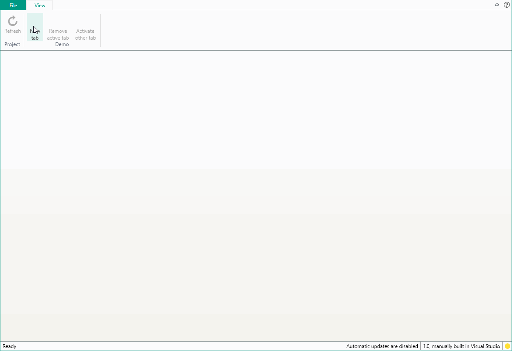

A common scenario in WPF is to use a tabbed interface to give the user the option to use multiple main views in a tabbed environment. This example shows how to implement this correctly with both closable and non-closable tabs.

For this example, we will have a few requirements:

-   Be able to add, close and activate tabs via a service
-   Be able to specify whether a tab can be closed by the end-user



## Creating the model describing a tab item

First of all, we need a model describing a tab item so we can interact with a service. We want the tab to be closeable via the service, but also via the view model it is representing.

```
public namespace TabDemo
{
    using System;
    using System.Threading.Tasks;
    using Catel;
    using Catel.MVVM;

    public class TabItem
    {
        public TabItem(IViewModel viewModel)
        {
            Argument.IsNotNull(() => viewModel);

            ViewModel = viewModel;
            CanClose = true;

            if (!viewModel.IsClosed)
            {
                viewModel.ClosedAsync += OnViewModelClosed;
            }
        }

        public IViewModel ViewModel { get; private set; }

        public bool CanClose { get; set; }

        public object Tag { get; set; }

        public event EventHandler<EventArgs> Closed; 

        private async Task OnViewModelClosed(object sender, ViewModelClosedEventArgs e)
        {
            var vm = ViewModel;
            if (vm != null)
            {
                vm.ClosedAsync -= OnViewModelClosed;
            }

            Closed.SafeInvoke(this);
        }
    }
}
```

Because we subscribe to the *ClosedAsync* event, we can close the tab from withing the view model.

## Creating the service

### Interface

```
namespace TabDemo.Services
{
    using System;
    using System.Collections.Generic;

    public interface ITabService
    {
        /// <summary>
        /// Gets all the tabs.
        /// </summary>
        /// <value>The tabs.</value>
        IEnumerable<TabItem> Tabs { get; }

        /// <summary>
        /// Gets the selected tab.
        /// </summary>
        /// <value>The selected tab.</value>
        TabItem SelectedTab { get; }

        /// <summary>
        /// Occurs when the selected tab has changed.
        /// </summary>
        event EventHandler<TabItemEventArgs> SelectedTabChanged;

        /// <summary>
        /// Determines whether the specified tab item is visible.
        /// </summary>
        /// <param name="tabItem">The tab item.</param>
        /// <returns><c>true</c> if the specified tab item is visible; otherwise, <c>false</c>.</returns>
        /// <exception cref="ArgumentNullException">The <paramref name="tabItem"/> is <c>null</c>.</exception>
        bool IsVisible(TabItem tabItem);

        /// <summary>
        /// Determines whether the specified tab item is active.
        /// </summary>
        /// <param name="tabItem">The tab item.</param>
        /// <returns><c>true</c> if the specified tab item is active; otherwise, <c>false</c>.</returns>
        /// <exception cref="ArgumentNullException">The <paramref name="tabItem"/> is <c>null</c>.</exception>
        bool IsActive(TabItem tabItem);

        /// <summary>
        /// Shows the specified tab item in a tab.
        /// <para />
        /// If the tab is already in the list of open tabs, this method won't do anything.
        /// </summary>
        /// <param name="tabItem">The tab item.</param>
        /// <exception cref="ArgumentNullException">The <paramref name="tabItem"/> is <c>null</c>.</exception>
        void Add(TabItem tabItem);

        /// <summary>
        /// Shows the specified tab item in a tab.
        /// <para />
        /// If the tab is already in the list of open tabs, this method won't do anything.
        /// </summary>
        /// <param name="index">The index.</param>
        /// <param name="tabItem">The tab item.</param>
        /// <exception cref="ArgumentNullException">The <paramref name="tabItem" /> is <c>null</c>.</exception>
        void Insert(int index, TabItem tabItem);

        /// <summary>
        /// Activates the specified tab item.
        /// </summary>
        /// <param name="tabItem">The tab item.</param>
        /// <exception cref="ArgumentNullException">The <paramref name="tabItem"/> is <c>null</c>.</exception>
        /// <exception cref="InvalidOperationException">The <paramref name="tabItem"/> is not visible, use <see cref="Add"/> first.</exception>
        void Activate(TabItem tabItem);

        /// <summary>
        /// Hides the specified tab item.
        /// <para />
        /// If the tab is not in the list of open tabs, this method won't do anything.
        /// </summary>
        /// <param name="tabItem">The tab item.</param>
        /// <exception cref="ArgumentNullException">The <paramref name="tabItem"/> is <c>null</c>.</exception>
        void Remove(TabItem tabItem);
    }
}
```

### Implementation

```
namespace TabDemo.Services
{
    using System;
    using System.Collections.Generic;
    using System.Linq;
    using System.Windows.Controls;
    using Catel;
    using Catel.Logging;
    using Catel.MVVM;
    using Catel.Windows.Threading;
    using TabItem = TabDemo.TabItem;

    public class TabService : ITabService
    {
        private static readonly ILog Log = LogManager.GetCurrentClassLogger();

        private TabControl _tabControl;

        public TabService()
        {
        }

        public IEnumerable<TabItem> Tabs
        {
            get
            {
                if (_tabControl == null)
                {
                    return new List<TabItem>();
                }

                return (from tab in _tabControl.Items.Cast<object>()
                        where tab is TabItem
                        select (TabItem)tab).ToList();
            }
        }

        public TabItem SelectedTab
        {
            get
            {
                if (_tabControl == null)
                {
                    return null;
                }

                var tabItem = _tabControl.SelectedItem as TabItem;
                return tabItem;
            }
        }

        public event EventHandler<TabItemEventArgs> SelectedTabChanged;

        internal void SetTabControl(TabControl tabControl)
        {
            Argument.IsNotNull(() => tabControl);

            if (_tabControl != null)
            {
                _tabControl.SelectionChanged -= OnTabControlSelectionChanged;
            }

            _tabControl = tabControl;
            _tabControl.SelectionChanged += OnTabControlSelectionChanged;
        }

        public bool IsVisible(TabItem tabItem)
        {
            Argument.IsNotNull(() => tabItem);

            if (_tabControl == null)
            {
                return false;
            }

            var isVisible = (from item in _tabControl.Items.Cast<object>()
                             where ReferenceEquals(tabItem, item)
                             select true).Any();
            return isVisible;
        }

        public bool IsActive(TabItem tabItem)
        {
            Argument.IsNotNull(() => tabItem);

            if (_tabControl == null)
            {
                return false;
            }

            var selectedTab = SelectedTab;
            var isActive = ReferenceEquals(selectedTab, tabItem);
            return isActive;
        }

        public void Add(TabItem tabItem)
        {
            Argument.IsNotNull(() => tabItem);

            if (_tabControl == null)
            {
                return;
            }

            Insert(_tabControl.Items.Count, tabItem);
        }

        public void Insert(int index, TabItem tabItem)
        {
            Argument.IsNotNull(() => tabItem);

            if (_tabControl == null)
            {
                return;
            }

            var isVisible = IsVisible(tabItem);
            if (isVisible)
            {
                return;
            }

            tabItem.Closed += OnTabItemClosed;

            _tabControl.Items.Insert(index, tabItem);
        }

        public void Activate(TabItem tabItem)
        {
            Argument.IsNotNull(() => tabItem);

            if (_tabControl == null)
            {
                return;
            }

            var isVisible = IsVisible(tabItem);
            if (!isVisible)
            {
                throw Log.ErrorAndCreateException<InvalidOperationException>("Tab item is not visible, use the Show() method first");
            }

            _tabControl.SelectedItem = tabItem;
        }

        public void Remove(TabItem tabItem)
        {
            Argument.IsNotNull(() => tabItem);

            if (_tabControl == null)
            {
                return;
            }

            tabItem.Closed -= OnTabItemClosed;

            _tabControl.RemoveAndUpdateSelection(tabItem);
        }

        private void OnTabItemClosed(object sender, EventArgs e)
        {
            var tabItem = sender as TabItem;
            if (tabItem != null)
            {
                tabItem.Closed -= OnTabItemClosed;

                if (_tabControl == null)
                {
                    return;
                }

                _tabControl.Dispatcher.BeginInvoke(() => Remove(tabItem));
            }
        }

        private void OnTabControlSelectionChanged(object sender, SelectionChangedEventArgs e)
        {
            var handler = SelectedTabChanged;
            if (handler != null)
            {
                var selectedTab = SelectedTab;
                handler(this, new TabItemEventArgs(selectedTab));
            }
        }
    }
}
```

## Creating the views

For this to work, the service needs to interact with views. We have a few views to create.

### Creating ClosableTabItem

#### Xaml

```
<UserControl x:Class="TabDemo.Controls.ClosableTabItem"
             xmlns="http://schemas.microsoft.com/winfx/2006/xaml/presentation"
             xmlns:x="http://schemas.microsoft.com/winfx/2006/xaml"
             xmlns:mc="http://schemas.openxmlformats.org/markup-compatibility/2006" 
             xmlns:d="http://schemas.microsoft.com/expression/blend/2008"
             xmlns:orchestra="https://github.com/orcomp/orchestra"
             xmlns:gum="http://www.wildgums.net.au/gum"
             xmlns:catel="http://schemas.catelproject.com"
             xmlns:controls="clr-namespace:TabDemo.Controls"
             mc:Ignorable="d" d:DesignHeight="300" d:DesignWidth="300">

    <StackPanel Orientation="Horizontal">
        <TextBlock Text="{Binding RelativeSource={RelativeSource AncestorType={x:Type controls:ClosableTabItem}}, Path=Title}"/>
        <Button Click="OnCloseButtonClick" Margin="5,0,0,0" Background="Transparent"
                Visibility="{Binding RelativeSource={RelativeSource AncestorType={x:Type controls:ClosableTabItem}}, Path=CanClose, Converter={catel:BooleanToCollapsingVisibilityConverter}}">

            <Image Source="{Image Source to a close Image}" Width="12" Height="12" />
        </Button>
    </StackPanel>

</UserControl>
```

#### Code behind

```
namespace Tabdemo.Controls
{
    using System.Windows;
    using System.Windows.Controls;
    using System.Windows.Data;
    using Catel.MVVM;
    using Catel.Windows;

    public partial class ClosableTabItem
    {
        #region Constructors
        public ClosableTabItem()
        {
            InitializeComponent();

            Loaded += OnLoaded;
        }
        #endregion

        public string Title
        {
            get { return (string)GetValue(TitleProperty); }
            set { SetValue(TitleProperty, value); }
        }

        public static readonly DependencyProperty TitleProperty = DependencyProperty.Register("Title", typeof(string),
            typeof(ClosableTabItem), new PropertyMetadata(string.Empty));

        public bool CanClose
        {
            get { return (bool)GetValue(CanCloseProperty); }
            set { SetValue(CanCloseProperty, value); }
        }

        public static readonly DependencyProperty CanCloseProperty = DependencyProperty.Register("CanClose", typeof(bool), 
            typeof(ClosableTabItem), new PropertyMetadata(true));

        private void OnLoaded(object sender, RoutedEventArgs e)
        {
            var vmContainer = Content as IViewModelContainer;
            if (vmContainer == null)
            {
                return;
            }

            var vm = vmContainer.ViewModel;
            if (vm == null)
            {
                var frameworkElement = vmContainer as FrameworkElement;
                if (frameworkElement != null)
                {
                    vm = frameworkElement.DataContext as IViewModel;
                }

                if (vm == null)
                {
                    return;
                }
            }

            SetBinding(TitleProperty, new Binding
            {
                Source = vm,
                Path = new PropertyPath("Title")
            });
        }

        private void OnCloseButtonClick(object sender, RoutedEventArgs e)
        {
            if (!CanClose)
            {
                return;
            }

            var tabControl = this.FindVisualAncestorByType<TabControl>();
            if (tabControl != null)
            {
                tabControl.RemoveAndUpdateSelection(DataContext);
            }
        }
    }
}
```

### Creating main view (tab control container)

#### Xaml

```
<catel:UserControl x:Class="TabDemo.Views.MainView"
                   xmlns="http://schemas.microsoft.com/winfx/2006/xaml/presentation"
                   xmlns:x="http://schemas.microsoft.com/winfx/2006/xaml"
                   xmlns:catel="http://schemas.catelproject.com"
                   xmlns:controls="clr-namespace:TabDemo.Controls">

    <catel:TabControl x:Name="tabControl" Margin="-2" LoadTabItems="LazyLoading">
        <TabControl.ItemTemplate>
            <DataTemplate>
                <controls:ClosableTabItem Title="{Binding ViewModel.Title}" CanClose="{Binding CanClose}" />
            </DataTemplate>
        </TabControl.ItemTemplate>

        <TabControl.ContentTemplate>
            <DataTemplate>
                <ContentControl Content="{Binding ViewModel, Converter={catel:ViewModelToViewConverter}}" />
            </DataTemplate>
        </TabControl.ContentTemplate>
    </catel:TabControl>

</catel:UserControl>
```

#### Code behind

```
namespace TabDemo.Views
{
    using Catel.IoC;
    using Services;

    public partial class MainView
    {
        public MainView()
        {
            InitializeComponent();

            var serviceLocator = this.GetServiceLocator();

            var tabService = serviceLocator.ResolveType<ITabService>() as TabService;
            if (tabService != null)
            {
                tabService.SetTabControl(tabControl);
            }
        }
    }
}
```

## Useful extension methods

Here are some useful extension methods

### ITabServiceExtensions

```
namespace TabDemo.Services
{
    using Catel;
    using Catel.IoC;
    using Catel.MVVM;
    using Services;

    public static class ITabServiceExtensions
    {
        public static TabItem Add<TViewModel>(this ITabService tabService, object dataContext = null, bool canClose = false)
            where TViewModel : IViewModel
        {
            Argument.IsNotNull(() => tabService);

            var tabItem = CreateTabItem<TViewModel>(tabService, dataContext);
            tabItem.CanClose = canClose;

            tabService.Add(tabItem);

            return tabItem;
        }

        public static TabItem AddAndActivate<TViewModel>(this ITabService tabService, object dataContext = null, bool canClose = false)
            where TViewModel : IViewModel
        {
            Argument.IsNotNull(() => tabService);

            var tabItem = Add<TViewModel>(tabService, dataContext, canClose);
            tabService.Activate(tabItem);

            return tabItem;
        }

        public static TabItem CreateTabItem<TViewModel>(this ITabService tabService, object dataContext)
            where TViewModel : IViewModel
        {
            Argument.IsNotNull(() => tabService);

            var dependencyResolver = tabService.GetDependencyResolver();
            var viewModelFactory = dependencyResolver.Resolve<IViewModelFactory>();

            var vm = viewModelFactory.CreateViewModel<TViewModel>(dataContext);
            return new TabItem(vm);
        }

        public static void AddAndActivate(this ITabService tabService, TabItem tabItem)
        {
            Argument.IsNotNull(() => tabService);
            Argument.IsNotNull(() => tabItem);

            tabService.Add(tabItem);
            tabService.Activate(tabItem);
        }
    }
}
```

### TabControlExtensions

```
namespace TabDemo.Services
{
    using System.Linq;
    using System.Windows.Controls;

    public static class TabControlExtensions
    {
        public static bool RemoveAndUpdateSelection(this TabControl tabControl, object tabItem)
        {
            var index = tabControl.Items.IndexOf(tabItem);
            if (index == -1)
            {
                return false;
            }

            var wasSelected = ReferenceEquals(tabControl.SelectedItem, tabItem);

            tabControl.Items.RemoveAt(index);

            if (wasSelected)
            {
                var newIndex = index;
                var newItem = newIndex < tabControl.Items.Count ? tabControl.Items[newIndex] : tabControl.Items.Cast<object>().LastOrDefault(x => x is TabItem);

                tabControl.SelectedItem = newItem;
            }

            return true;
        }
    }
}
```


## Using the service

### Adding a new tab and activate it

This adds and activates a new tab which the user is allowed to close:

```
_tabService.AddAndActivate<DemoTabViewModel>(null, true);
```

### Closing a tab from withing a view model

This closes a tab from within a tab view model. Closing a view model causes the *TabItem* to raise the *Closed* event and the *TabService* will correctly close the tab and update its selection.

```
this.SaveAndCloseViewModelAsync();
```

### Closing a tab from outside a view model

This closes the currently active tab:

```
var selectedTab = _tabService.SelectedTab;
_tabService.Remove(selectedTab);
```

## Download example

[Download example](../../downloads/tips-tricks/mvvm/using-tabbed-interface-with-mvvm/example.rar)

