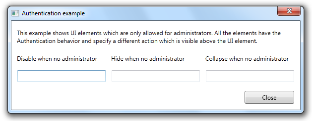
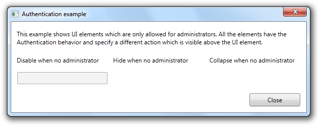

The Authentication behavior is able to hide, collapse or disable UI elements based on the current user state. The behavior uses the registered IAuthenticationProvider instances to determine whether the user has access to the specified UI element.

1) Creating an authentication provider:

```
/// <summary>
/// Example implementation of the <see cref="AuthenticationProvider"/>. This class is not really implemented
/// like it should, because it shouldn't be this easy to set the current role. However, for the sake of simplicity,
/// this class has a simple property with the role of the user.
/// </summary>
public class AuthenticationProvider : IAuthenticationProvider
{
    /// <summary>
    /// Gets or sets the role the user is currently in.
    /// </summary>
    /// <value>The role.</value>
    public string Role { get; set; }

    public bool CanCommandBeExecuted(ICatelCommand command, object commandParameter)
    {
        return true;
    }

    public bool HasAccessToUIElement(FrameworkElement element, object tag, object authenticationTag)
    {
        var authenticationTagAsString = authenticationTag as string;
        if (authenticationTagAsString != null)
        {
            if (string.Compare(authenticationTagAsString, Role, true) == 0)
            {
                return true;
            }
        }

        return false;
    }
}
```

2) Register the authentication provider in the service collection:

```csharp
services.AddSingleton<IAuthenticationProvider, AuthenticationProvider>();
```

3) Add the following XML namespaces to your view:

```
xmlns:i="clr-namespace:System.Windows.Interactivity;assembly=System.Windows.Interactivity"
xmlns:catel="http://schemas.catelproject.com"
```

4) Add the behavior. As shown, it is possible to provide a custom *AuthenticationTag*, which is passed to the *IAuthenticationProvider*:

```
<TextBox>
  <i:Interaction.Behaviors>
    <catel:Authentication AuthenticationTag="Administrator" Action="Disable" />
  </i:Interaction.Behaviors>
</TextBox>
```

5) Below are screenshots of the example applications:

**Logged in as administrator:**



**Logged in as read-only user:**



