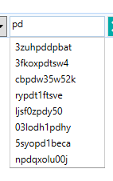

To enable auto completion features, once can use the services and behaviors provided by Catel. There are two components required for auto completion:

1. AutoCompletionService =\> takes care of the actual filtering
2. AutoCompletionBehavior =\> can be attached to a TextBox to support a dropdown with recommended values

The auto completion features looks like the screenshot below:



## AutoCompletion service

The default implementation automatically filters the collection specified. If there is no filter yet, it will filter the top 10 occurrences from the collection. When a filter is available, it will do the same but with the filter applied.

## AutoCompletion behavior

The behavior can be used as follows:

```
<catel:AutoCompletionBehavior PropertyName="{Binding PropertyName, Mode=OneWay}" 
                              ItemsSource="{Binding RawCollection}" IsEnabled="{Binding EnableAutoCompletion}"/>
```

If the `PropertyName` is `null` or whitespace, the `ItemsSource` will be treated as collection of strings to be filtered directly


