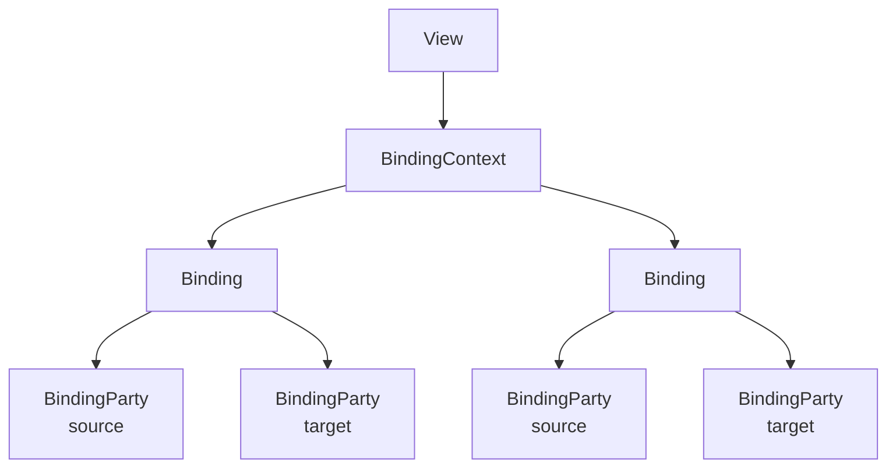

---
title: "Bindings" 
---
Catel provides a supplemental binding system for non-XAML platforms, which is described in this topic.

For examples, check out the following pages:

- [Property bindings]()
- [Command bindings]()

# Binding system explained

The binding system consists of several classes. Below is an architectural overview.

As the image shows, each view will have their own `BindingContext`. A `BindingContext` contains all the bindings currently available in the view and allows adding / removing bindings dynamically when required. As soon as a major change occurs (such as a new view model), a new `BindingContext` will be created and the old one will be cleaned up. The views in Catel will automatically take care of the `BindingContext` initialization and lifetime management.

Each `Binding` is a mapping from source to target. It also allows the specification of a converter like available in the XAML platforms. Each `Binding` also contains several `BindingParty` objects. The default value for `BindingMode` is `BindingMode.TwoWay.`

A `BindingParty` is an object that will take care of watching the source or target of the binding and inform the binding when a value has been changed. The binding parties are considered equal and contain the same logic for both the source and target of the binding.

All bindings must be initialized in the `AddBindings` method that is available on all views provided by Catel. 

