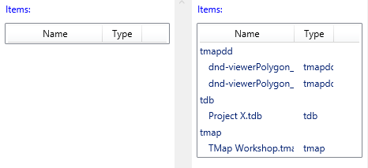

For the most part the resources declared within a Catel `UserControl` behave the exact same as resources defined in the standard 
`UserControl`. However because of the way the Catel `UserControl` operates (see [UserControl Under the hood]()) any bindings performed inside a Resource will not be found at runtime (example CollectionViewSource Source) . The solution is to declare the resource inside an element within the UserControl, not at the UserControl level. Example below:

Given this simple Model and ViewModel (Catel.Fody used for parameter declaration)

```
    public class DataSource : ModelBase
    {
        public int Id { get; set; }
        public string URI { get; set; }
        public string DataSourceType { get; set; }
        public string Description { get; set; }
        public string ShortURI
        {
            get
            {
                if (string.IsNullOrEmpty(URI)) return null;
                Uri uri = new System.Uri(URI);
                if (uri.IsFile)
                {
                    return System.IO.Path.GetFileName(uri.LocalPath);
                }
                return URI;
            }
        }
    }

    public class DocumentViewModel : ViewModelBase
    {
        public DocumentViewModel(ICommandManager commandManager)
        {           
            ProjectDataSources = new FastObservableCollection<DataSource>();
            ProjectDataSources.Add(new DataSource() { Id = 1, URI = "file:///D:/src/TAnaylze/Data/DataSources/dnd-viewerPolygon_AoI-Intergranular_porosity.json", DataSourceType = "tmapdd", Description = "From TMap DragDrop" });
            ProjectDataSources.Add(new DataSource() { Id = 2, URI = "file:///D:/src/TAnaylze/Data/DataSources/dnd-viewerPolygon_AoI-Intergranular_porosity.json", DataSourceType = "tmapdd" });
            ProjectDataSources.Add(new DataSource() { Id = 3, URI = "file:///D:/src/TAnaylze/Data/DataSources/Project X.tdb", DataSourceType = "tdb", Description = "Project X.tdb" });
            ProjectDataSources.Add(new DataSource() { Id = 4, URI = "file:///D:/src/TAnaylze/Data/DataSources/TMap Workshop.tmap", DataSourceType = "tmap", Description = "TMap Workshop.tmap" });
        }
        public FastObservableCollection<DataSource> ProjectDataSources { get; set; }

    }
```

and this View:

**View**

```
<catel:UserControl x:Class="Catel.Examples.WPF.Commanding.Views.DocumentView"
                   xmlns="http://schemas.microsoft.com/winfx/2006/xaml/presentation"
                   xmlns:x="http://schemas.microsoft.com/winfx/2006/xaml"
                   xmlns:sys="clr-namespace:System;assembly=mscorlib"
                   xmlns:catel="http://schemas.catelproject.com">
    <catel:UserControl.Resources>
        <ResourceDictionary>
            <!-- The Resource ListViewTitle will be found at run time -->
            <sys:String x:Key="ListViewTitle">Items:</sys:String>
            <!-- The Resource DataSourceGroup will be found but the binding will not work. -->
            <CollectionViewSource x:Key="DataSourceGroup"                               
                      Source="{Binding ProjectDataSources}" IsLiveSortingRequested="True" IsLiveGroupingRequested="True">
                <CollectionViewSource.GroupDescriptions>
                    <PropertyGroupDescription PropertyName="DataSourceType" />
                </CollectionViewSource.GroupDescriptions>
            </CollectionViewSource>
        </ResourceDictionary>
    </catel:UserControl.Resources>
    <Grid>
        <Grid.ColumnDefinitions>
            <ColumnDefinition Width="*" />
            <ColumnDefinition Width="5" />
            <ColumnDefinition Width="*" />
        </Grid.ColumnDefinitions>

        <ScrollViewer Grid.Column="0">
            <StackPanel>
                <StackPanel.Resources>

                </StackPanel.Resources>

                <Label Foreground="Blue" Margin="5,5,5,0" Content="{StaticResource ListViewTitle}"></Label>
                <ListView Name="_datasourcelv1" ItemsSource="{Binding Source={StaticResource DataSourceGroup}}">

                    <ListView.View>
                        <GridView>
                            <GridViewColumn Header="Name" Width="120" DisplayMemberBinding="{Binding ShortURI}" />
                            <GridViewColumn Header="Type" Width="50" DisplayMemberBinding="{Binding DataSourceType}" />
                        </GridView>
                    </ListView.View>

                    <ListView.GroupStyle>
                        <GroupStyle>
                            <GroupStyle.HeaderTemplate>
                                <DataTemplate>
                                    <TextBlock Text="{Binding Name}"/>
                                </DataTemplate>
                            </GroupStyle.HeaderTemplate>
                        </GroupStyle>
                    </ListView.GroupStyle>
                </ListView>
            </StackPanel>
        </ScrollViewer>
        <GridSplitter Grid.Column="1" Width="5" HorizontalAlignment="Stretch" />
        <ScrollViewer Grid.Column="2">

            <StackPanel>
                <StackPanel.Resources>
                    <!-- The solution is to embed the resource inside the UserControl, this way the binding is within the runtime Visual Tree. -->
                    <CollectionViewSource x:Key="DataSourceGroup2"                               
                      Source="{Binding ProjectDataSources}" IsLiveSortingRequested="True" IsLiveGroupingRequested="True">
                        <CollectionViewSource.GroupDescriptions>
                            <PropertyGroupDescription PropertyName="DataSourceType" />
                        </CollectionViewSource.GroupDescriptions>
                    </CollectionViewSource>
                </StackPanel.Resources>

                <Label Foreground="Blue" Margin="5,5,5,0" Content="{StaticResource ListViewTitle}"></Label>
                <ListView Name="_datasourcelv2" ItemsSource="{Binding Source={StaticResource DataSourceGroup2}}">

                    <ListView.View>
                        <GridView>
                            <GridViewColumn Header="Name" Width="120" DisplayMemberBinding="{Binding ShortURI}" />
                            <GridViewColumn Header="Type" Width="50" DisplayMemberBinding="{Binding DataSourceType}" />
                        </GridView>
                    </ListView.View>

                    <ListView.GroupStyle>
                        <GroupStyle>
                            <GroupStyle.HeaderTemplate>
                                <DataTemplate>
                                    <TextBlock Text="{Binding Name}"/>
                                </DataTemplate>
                            </GroupStyle.HeaderTemplate>
                        </GroupStyle>
                    </ListView.GroupStyle>
                </ListView>
            </StackPanel>
        </ScrollViewer>        
    </Grid>
</catel:UserControl>
```


Will produce this at runtime:




The ListView on the left is not populated because the binding is not found and will produce this error:

```
System.Windows.Data Error: 40 : BindingExpression path error: 'ProjectDataSources' property not found on 'object' ''MainWindowViewModel' (HashCode=-1500006600)'. BindingExpression:Path=ProjectDataSources; DataItem='MainWindowViewModel' (HashCode=-1500006600); target element is 'CollectionViewSource' (HashCode=5965360); target property is 'Source' (type 'Object')
```

While the ListView on the right has the correct content due to the proper binding. Further discussion on [Stack Overflow](http://stackoverflow.com/questions/31488173/binding-from-within-a-resourcedictionary-in-a-catel-wpf-usercontrol).

