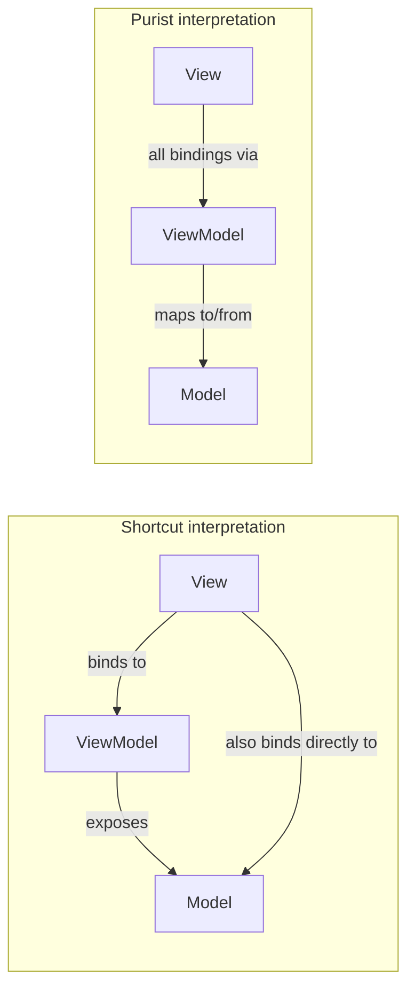

There are two different interpretations of MVVM, the "purist" way where the model is protected, or the "shortcut" way where the view model only provides the instance of the model and the view then binds directly to the model.

## Shortcut interpretation

This is what most people do. The view model implements the model, and then provides the model to the view. The view then binds directly to the model.

**Advantages**

- Easy to use
- Fast since view model hardly contains any properties

**Disadvantages**

- Always need to bind to Model.[PropertyName], but for view model properties it is just [PropertyName], might be confusing
- Less control over validation (you cannot insert logic between View \<=\> Model where MVVM is all about

## Purist interpretation

This is what the developers of Catel strongly believe in. It requires somewhat more code, but gives great freedom and control and protection of the model because all bindings go through the view model.

**Advantages**

- Full contol and freedom, you can inject both logic and validation between view and model (what MVVM is actually about)
- Everything is available on the view model, no need for "sub-bindings" (such as Model.[PropertyName])
- Protection of your model from the view

**Disadvantages**

Needs somewhat more code (but thanks to code snippets and the Expose attribute, this is not a big disadvantage)

