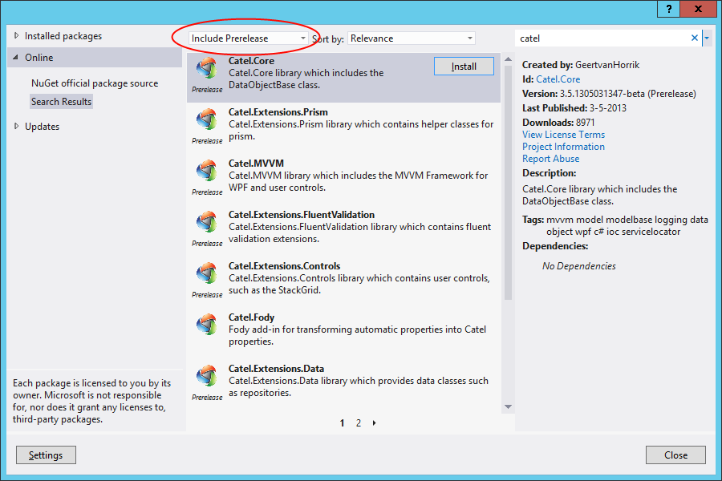

---
title: "Getting prerelease (beta) versions via NuGet" 
---

## Installing via package manager

Please ensure to select the same settings as in the screenshow below:



## Installing via package manager console

This example installs Catel.MVVM as a package. However, to install other packages simple change the ID (name) of the package.

**Installing the latest beta**

```
Install-Package Catel.MVVM –IncludePrerelease
```

**Installing a specific beta**

```
Install-Package Catel.MVVM –IncludePrerelease -version 5.0.0-unstable0532
```

**Updating to the latest beta**

```
Update-Package Catel.MVVM –IncludePrerelease
```

**Updating to a specific beta**

```
Update-Package Catel.MVVM –IncludePrerelease -version 5.0.0-unstable0532
```

**Updating to the latest stable version**

```
Update-Package Catel.MVVM
```

