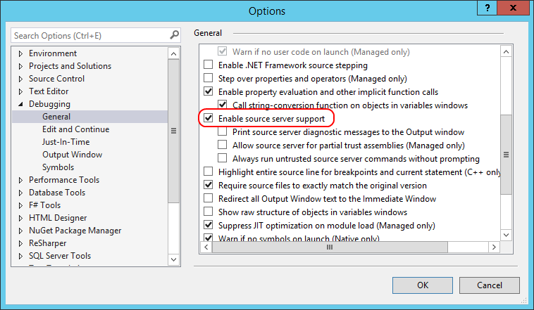

---
title: 'Stepping through the code'
---
It is possible to step through the source code of Catel. This will give great insights when debugging applications because you can actually see what is happening inside Catel.

To enable stepping through the source code, use the following steps:

1. Install any Catel package via NuGet (all have support for stepping through the code)
2. Enable source server support in Visual Studio:

Note that you must have defined a valid symbols directory in order for symbols to be stored on disk

