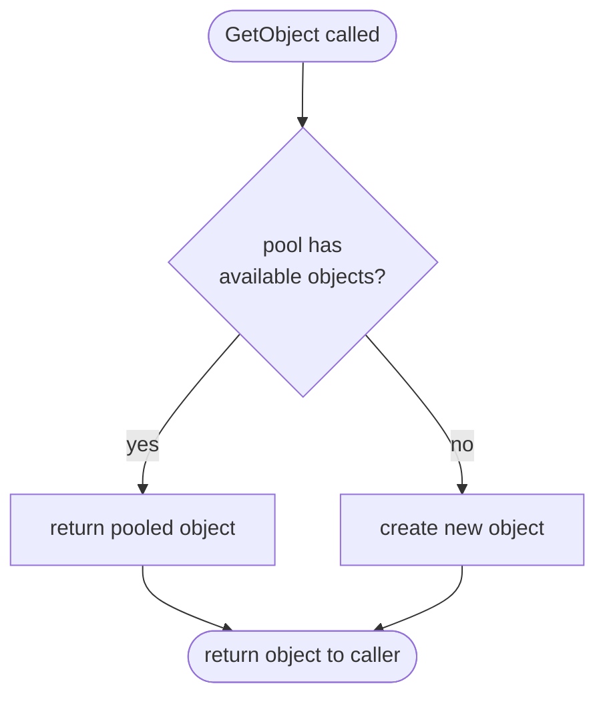
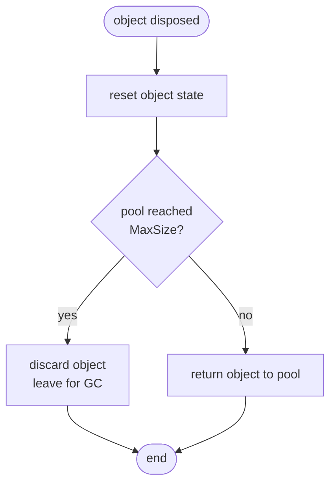

---
title: "Pooling" 
---
Garbage collection in .NET can be very expensive, especially for objects on the Large Object Heap (LOH). .NET itself already uses pooling for threads to prevent the costly creation of threads but instead re-uses the already created threads using a thread pool. Catel provides an implementation of pooling using the `PoolManager<TPoolable>`. This allows both Catel and third party developers to create a pool for large objects so they can be reused.

The documentation uses a byte array of 4096 as poolable object as example. If `_poolManager` is used in the code below, it represents an instance of `PoolManager<Buffer4096Poolable>`

## Introduction to the pool manager

The pool manager internally uses a stack to manage the available objects in the pool. It's important to understand how a pool works. The flow diagram below shows how the pool manager deals with objects:



It is recommended that a pool manager gets registered in the *ServiceLocator* so it can be re-used by multiple components.

Note that the pool manager does not limit the number of objects in memory. It has a `MaxSize` property so it will store only a maximum amount of objects inside the internal pool, but if the pool is running out of instances and a new object is requested, it will return a new instance (and thus creating a new object which could be garbage collected).

### Retrieving objects from the pool

Retrieving an object from the pool is very simple. When an instance of the `PoolManager<TPoolable>` is available, use the code below:

```
var poolableBuffer = _poolManager.GetObject();
```

The `PoolManager<TPoolable>` will automatically create a new object when no objects are available in the pool.

### Returning objects to the pool

Objects should be automatically returned to the pool when the objects are disposed. This means the objects are not really disposed but the state is being reset and the object is being returned to the pool. To automatically take care of this, it's best to use the `PoolManager<TPoolable>` as shown below:

```
using (var poolableBuffer = _poolManager.GetObject())
{
    var buffer = poolableBuffer.Data;

    // work with the buffer here
}

// outside the scope, the object is automatically disposed and returned to the pool
```

The flow chart below shows how the `PoolManager<TPoolable>` will handle the dispose:



## Customizing a pool manager

Catel implements pooling via the `PoolManager<TPoolable>` class. This class allows the caller to retrieve an object. There is no need to explicitly derive a class from the `PoolManager<TPoolable>`. It can be customized though.

### Customizing the maximum size

By default, the `PoolManager<TPoolable>` uses a maximum size of 5 MB per poolable type. If, for this example, the maximum size of byte buffers should be 1 MB, use the code below:

```
var poolManager = new PoolManager<Buffer4096Poolable>();
poolManager.MaxSize = 1024 * 1024 * 1;
```

If the `MaxSize` is reached, objects will not be added back to the internal pool but be left out and, if no other references exist to this object, be ready for garbage collection.

## Creating a poolable object

Since the objects need to be re-used, it's very important that the `PoolManager<TPoolable>` knows how to reset objects to the initial state. Therefore every poolable object needs to implement `IPoolable` which also implements `IDisposable`. Below is an example implementation of a poolable object.

```
public class Buffer4096Poolable : IPoolable
{
    private const int BufferSize = 4096;
    protected IPoolManager _poolManager;

    public Buffer4096Poolable()
    {
        Data = new byte[BufferSize];
    }

    public byte[] Data { get; private set; }

    public int Size { get { return BufferSize; } }

    public void Reset()
    {
        var buffer = Data;
        Array.Clear(buffer, 0, buffer.Length);
    }

    // Implemented explicitly so it can't be called accidentally
    void IPoolable.SetPoolManager(IPoolManager poolManager)
    {
        _poolManager = poolManager;
    }

    public void Dispose()
    {
        _poolManager.ReturnObject(this);
    }
}
```

