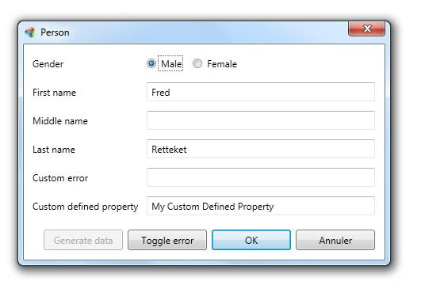

The `IUIVisualizerService` allows a developer to show (modal) windows or dialogs without actually referencing a specific view. Internally, the `UIVisualizerService` uses the `ViewLocator` to resolve views.

## Screenshot



## Showing a non-modal window

To show a non-modal window, inject the service via the constructor and use:

```csharp
private readonly IUIVisualizerService _uiVisualizerService;

public MyViewModel(IServiceProvider serviceProvider, IUIVisualizerService uiVisualizerService)
    : base(serviceProvider)
{
    _uiVisualizerService = uiVisualizerService;
}
```

```csharp
var viewModel = new EmployeeViewModel();
_uiVisualizerService.Show(viewModel);
```

## Showing a modal window

To show a modal window, use the following code:

```csharp
var viewModel = new EmployeeViewModel();
_uiVisualizerService.ShowDialog(viewModel);
```

## Showing a window with callback

To show a (modal or non-modal) window and get a callback as soon as the window is closed, use the following code:

```csharp
var viewModel = new EmployeeViewModel();
_uiVisualizerService.Show(viewModel, OnWindowClosed);
```

## Registering a window

To register a custom window which is not automatically detected via reflection, it is required to use the Register method:

```csharp
_uiVisualizerService.Register(typeof(EmployeeViewModel), typeof(EmployeeView));
```

## Using naming conventions to find windows

Please see the [ViewLocator]() topic.


