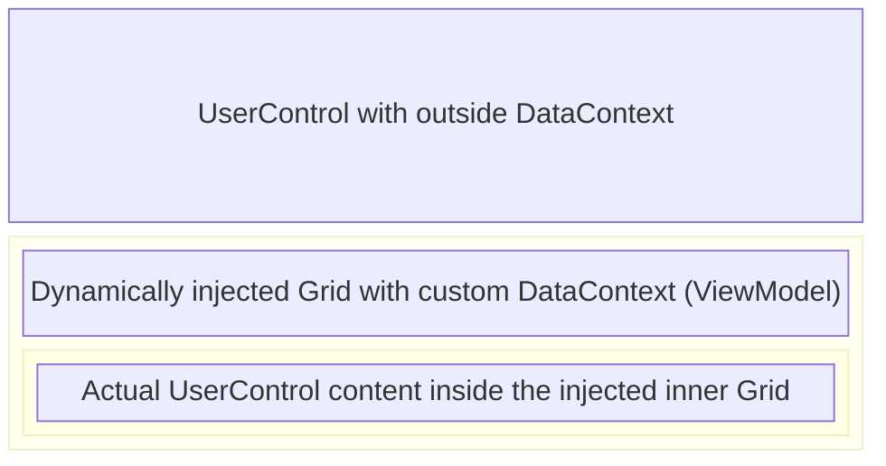
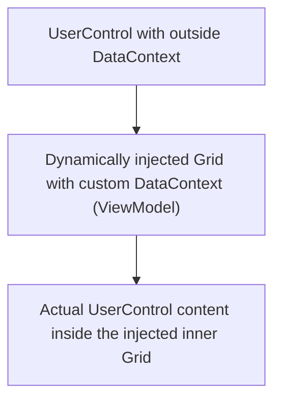
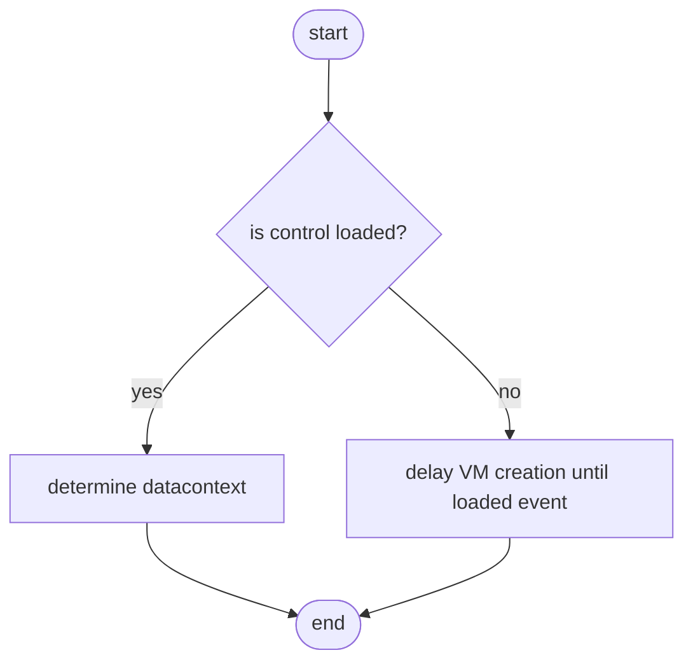
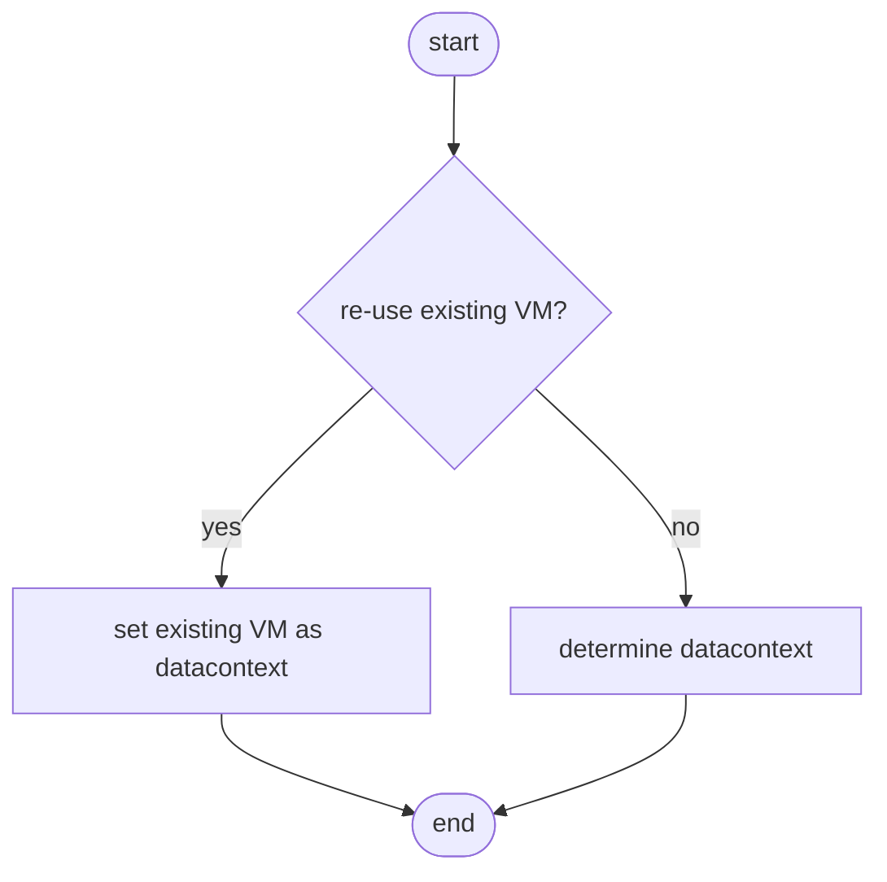
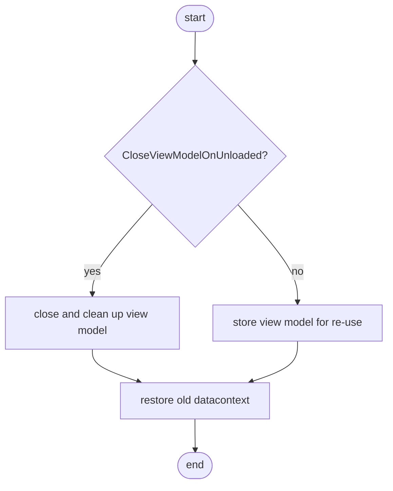
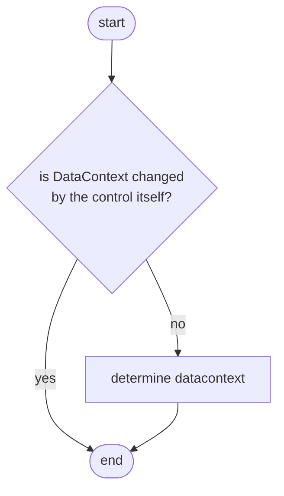
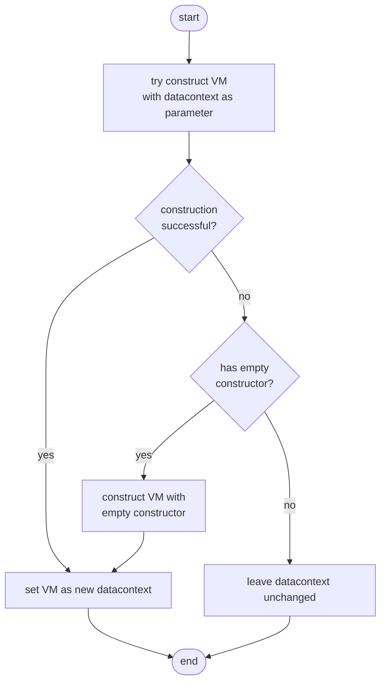

The `UserControl` is a pretty sophisticated class. In this part of the documentation, the inner workings of the control are explained. What better way is there than to using flowcharts. There are a few events very important for the inner workings of the user control. The flowcharts are created per event.

Keep in mind that the actual logic is implemented in the `UserControlLogic`, which is used by the `UserControl`. This way, the logic can be used by any user control via the `UserControlBehavior`.

## Managing the custom DataContext

The `UserControl` logic uses an additional layer to customize the DataContext. Below is a graphical representation of how it works.

Another view can be found in the diagram below:

## Main flow

The following flowchart shows what happens with a user control in the main flow (the startup). First, it checks whether the user control is loaded (which is not in a normal case). If the control is loaded, it goes directly to determining the datacontext. Otherwise, it will postpone the action until the `Loaded` event. 

## Loaded

When the control is loaded, it starts checking for the first time whether the current datacontext can be used to create a view model. But, before it does this, it checks whether it should (and can) re-use an existing view model. To control whether view models should be re-used, use the `CloseViewModelOnUnloaded` property.

If a view model can and should be re-used, it sets the view model as data context and that's it. If there is no view model, or the previous view model should not be re-used, the control continues to determine the datacontext.

## Unloaded

Another event that is very important is the `Unloaded` event. In this event, the control either cleans up the view model or stores it so it can be re-used later. Then, it also restores the old datacontext so it never breaks existing application bindings. This way, the control won't leave any traces behind.

## DataContextChanged

The `DataContextChanged` event is used to react to changes of the datacontext. We use the `DataContextHelper` class for that. If the new datacontext is new (thus not a view model that the control just set itself), it it continues to determine the datacontext. Otherwise, it will not take any action.

## DetermineDataContext

All other flowcharts eventually led to this flowchart, the determination of the datacontext. The determination of the datacontext is very important, because this is the moment where the user control transforms the datacontext into a new view model if possible. First it tries is to construct the view model with the datacontext. So, if the datacontext is an object of type Person, and the view model of the user control has a constructor that accepts a Person object, it injects the datacontext into the constructor of the view model. If that fails, or there is simply no constructor, the control checks whether the view model has an empty constructor. If so, it constructs the view model and sets it as the new datacontext. If not, it will leave the datacontext untouched.

Basically, this is all that happens on a higher level to transform a datacontext into a view model. Under the hood, it's a bit more complicated but again, on a higher level this is what happens.

