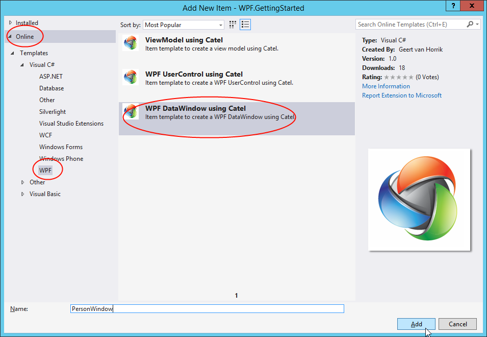

In this step we will create the windows for the application. In the previous step we already created the user controls. Windows are a great way to show in an edit-context. Catel provides great edit-windows in the form of the `DataWindow`. This is a window that automatically adds *OK* and *Cancel* buttons (but allows customization of the buttons and behavior).

## Person window

It is important that the window derives from one of the Catel windows. This is required to make the binding system work (same as `UserControl`). ensure that the window definition in the xaml is either `catel:Window` or `catel:DataWindow`

To add a new `DataWindow`, right-click the *Views* folder in the solution =\> *Add* =\> *New item...* =\> *On-line* =\> and search for Catel as shown, in the screen below:



Give the new view the name `PersonWindow`. The view will be added to the *Views* folder.

Note that we can use the `PersonViewModel` for both the `PersonView` (user control) and `PersonWindow`. Both views represent the same models and view models, just a different context. To ensure that the `IUIVisualizerService` knows what view to pick first, register the `PersonWindow` in the `IUIVisualizerService` at application startup:

```
var uiVisualizerService = serviceLocator.ResolveType<IUIVisualizerService>();
uiVisualizerService.Register(typeof(PersonViewModel), typeof(PersonWindow));
```

The template will also create a constructor to inject a view model into the window. Please ensure that the constructor takes a view model of the type `PersonViewModel` instead of the generated `PersonWindowModel`. Then replace the content of the view with the xaml below:

```
<Grid>
    <Grid.RowDefinitions>
        <RowDefinition Height="Auto" />
        <RowDefinition Height="Auto" />
    </Grid.RowDefinitions>

    <Grid.ColumnDefinitions>
        <ColumnDefinition Width="Auto" />
        <ColumnDefinition Width="*" />
    </Grid.ColumnDefinitions>

    <Label Grid.Row="0" Grid.Column="0" Content="First name" />
    <TextBox Grid.Row="0" Grid.Column="1" Text="{Binding FirstName, ValidatesOnDataErrors=True, NotifyOnValidationError=True}" />

    <Label Grid.Row="1" Grid.Column="0" Content="Last name" />
    <TextBox Grid.Row="1" Grid.Column="1" Text="{Binding LastName, ValidatesOnDataErrors=True, NotifyOnValidationError=True}" />
</Grid>
```

## Family window

The `FamilyWindow` is somewhat different because we want additional logic in this window. We want to create add / edit / remove buttons for the family members. Therefore we need to create a separate view model which contains this logic. 

### Creating the FamilyWindowViewModel

Since the `FamilyWindowViewModel` will look a lot like the `FamilyViewModel`, just copy/paste the `FamilyViewModel` and rename the copy to `FamilyWindowViewModel`.

Note that the `FamilyWindowViewModel` needs additional logic, but that will be handled in the next part of this getting started guide

### Creating the FamilyWindow

Once the `FamilyWindowViewModel` is created, the `FamilyWindow` must be created exactly the same way as the `PersonWindow`. Again ensure to use the right view model (`FamilyWindowViewModel`) in the constructor of the window in the code-behind. Then use the following xaml:

```
<Grid>
    <Grid.RowDefinitions>
        <RowDefinition Height="Auto" />
        <RowDefinition Height="Auto" />
        <RowDefinition Height="*" />
    </Grid.RowDefinitions>

    <Grid.ColumnDefinitions>
        <ColumnDefinition Width="Auto" />
        <ColumnDefinition Width="*" />
    </Grid.ColumnDefinitions>

    <Label Grid.Row="0" Grid.Column="1" Content="Family name" />
    <TextBox Grid.Row="0" Grid.Column="1" Text="{Binding FamilyName, NotifyOnValidationError=True, ValidatesOnDataErrors=True}" />

    <Label Grid.Row="1" Grid.ColumnSpan="2" Content="Persons" />

    <Grid Grid.Row="2" Grid.ColumnSpan="2">
        <Grid.ColumnDefinitions>
            <ColumnDefinition Width="*" />
            <ColumnDefinition Width="Auto" />
        </Grid.ColumnDefinitions>

        <ListBox Grid.Column="0" ItemsSource="{Binding Persons}" SelectedItem="{Binding SelectedPerson}">
            <ListBox.ItemTemplate>
                <DataTemplate>
                    <views:PersonView DataContext="{Binding}" />
                </DataTemplate>
            </ListBox.ItemTemplate>
        </ListBox>

        <StackPanel Grid.Column="1">
            <Button Command="{Binding AddPerson}" Content="Add..." />
            <Button Command="{Binding EditPerson}" Content="Edit..." />
            <Button Command="{Binding RemovePerson}" Content="Remove" />
        </StackPanel>
    </Grid>
</Grid>
```

## Up next

[Hooking up everything together]()

