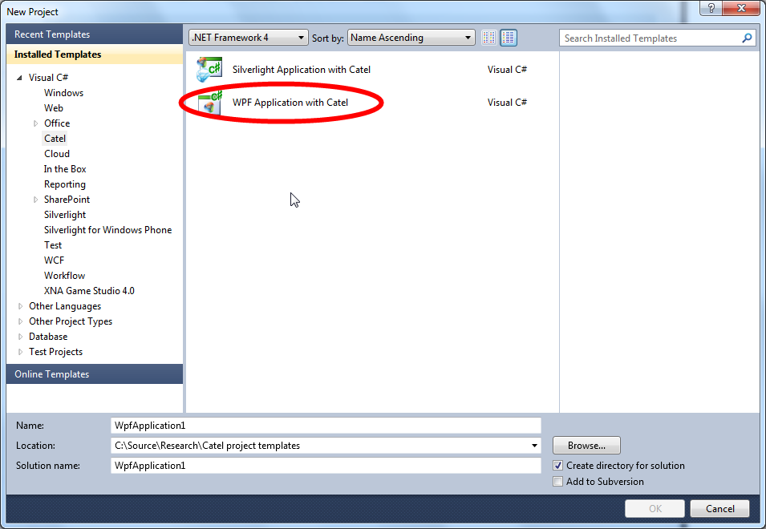

There are several project templates available for Catel. The easiest way is to follow these steps.

## Using the project templates

Create a new project. ensure that at least .NET Framework 4.0 is selected as target framework. The templates can be found under the Catel folder as shown in the image below:

As soon as the project is created, the only thing left to do is add references to the Catel libraries. You can either do this manually or use NuGet.

